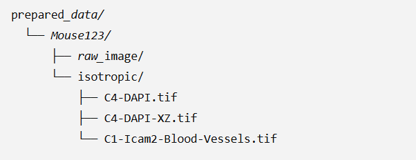
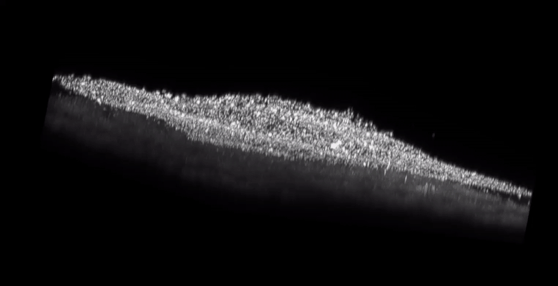

# Retinal Analysis -  DAPI and Vasculature
Software and tools to perform Vasculature and DAPI analysis on mouse retina

This is a submodule that's part of a larger project to perform retinal analysis.

If you're interested in performing Microglia and Astrocyte analysis in addition to DAPI and Vasculature, please stay tuned
repo soon to be released for comprehensive four pipeline retinal analysis.


## Environment and Set up

For data preparation, we use a FIJI macro. Please refer to the data preparation section for more details.

To execute the DAPI and Vasculature pipelines after data preparation, we need a python environment. The environment with dependicies can be found inside the environment.yml 

To set up the environment in conda you can run the following commands,

```
conda env create -f environment.yml
```

Activate the environment,
```
conda activate retinal_analysis
```
Once the environment is activate, the python notebooks inside 2_DAPI_Analysis and 3_Vasculature_Analysis can be executed. 

Note: To run vasculature, DAPI outputs are a prerequisite


## Data Preparation

The susequent DAPI and Vasculature analyses, expects the data be of the following folder structure. For each sample, there should be a folder with two subfolder called , raw and isotropic. Inside isotropic we need three files, DAPI stack, DAPI stack in XZ cross sectional view and blood vessel stack. A Sample structure would look like this 





If you have individual DAPI stained images or Iba1 stained images then use the  data_preparation_single.ijm macro file to prepare your data. If you have a multichannel image, with series blocks then use the data_preparation_batch.ijm macro file. These macro files will automatically create a folder structure of the required format.


## How to perform DAPI Analysis ?

Once the data is prepared, the DAPI pipeline can be exeuted using the main_pipeline_DAPI.ipynb python notebook inside the 2_DAPI_Analysis folder. The code will automatically download the neural network model weights and perform segmentation and analysis. 

Note : Input and output path inside the notebook should be the parent folder which will contain mouse sample names inside. For example, the "prepared_data" folder can be an input folder.

The installed python environment from the yml file comes with a jupyter environment. Below is one of the ways you can execute the notebook,

1. Open jupyter lab after navigating to the folder

```
cd Retinal_Analysis_Vas
jupyter lab
```

2. Navigate to the python notebook file inside jupyter lab and execute the notebook

For each sample, there will be a "C4-DAPI-XZ_reconstructed_cleaned_xy.tif". This is the final segmentation output file. The output segmentation will be an instance mask delineating the layers - RNFL, GCL, IPL, INL, OPL, ONL, and IS/OS.  

The 3D sample output will look like below,




To visualize in 3d, you can use napari which comes along with the installed environment.

## How to perform Vasculature Analysis ?

After performing DAPI analysis, vasculature analysis can be performed in two steps. First step is the segmentation step which can be completed by executing the 1_Blood_Cessel_Segmentation.ipynb.  The second step is to perform a feature extraction and branch analysis on the segmented image which can be done by executing the 2_Blood_Vessel_Post_Segmentation.ipynb.

Note : Input and output path inside both the notebooks should be the parent folder which will contain mouse sample names inside. For example, the prepared_data folder in the previous folder structure image can be an input folder.

The final instance segmentation output file is "C1-Icam2-Blood-Vessels_branch_labels_nnunet.tif". The final sementic segmentation output file is "C1-Icam2-Blood-Vessels_nnunet_reconstructed_cleaned_filtered.tif". For each sample csv feature files will be generated. 

A 3D segmentation output will look like below,


